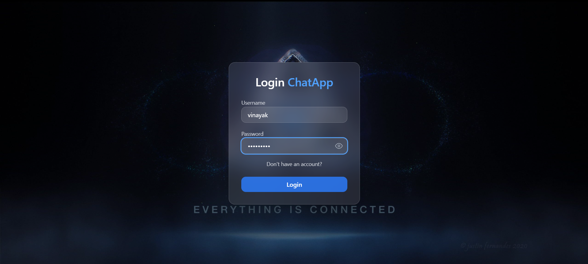
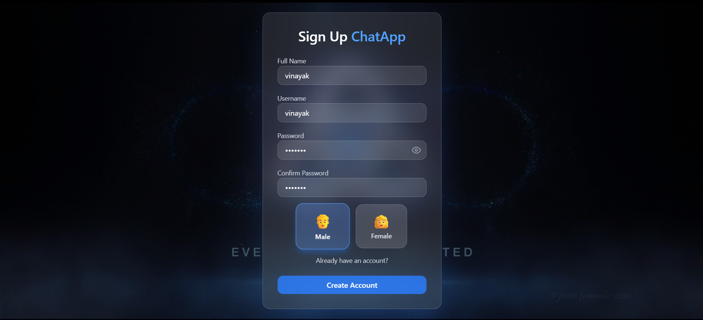
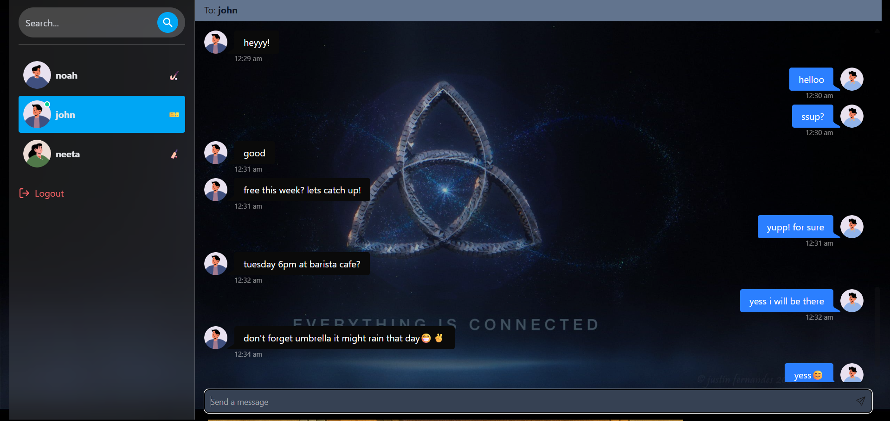
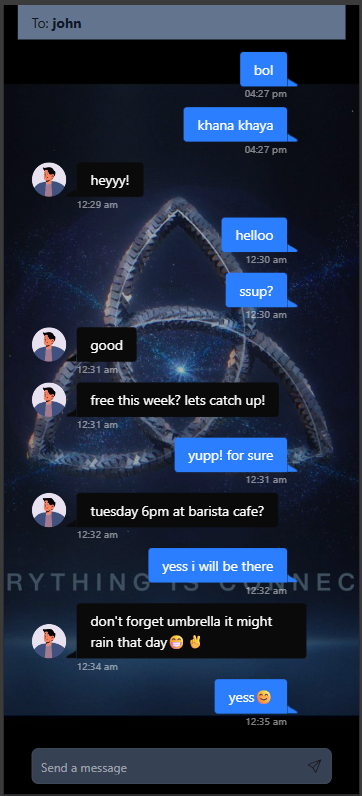

# 💬ChitChat- Real-Time Chat Application

A modern **real-time chat application** built using the **MERN stack** with **Socket.IO** for instant messaging, online user tracking, and a clean responsive UI.

---

## 🚀 Features

* 🔐 JWT Authentication (Login / Signup)
* 💬 Real-time messaging using Socket.IO
* 🟢 Online / Offline user status
* 🔔 Message notification sound
* 📱 Fully responsive (Desktop & Mobile)
* 🔍 Search users to start chat
* 🎭 Random emoji avatar per conversation
* 🧼 Clean UI with Tailwind CSS & DaisyUI
* ♻️ Auto scroll to latest message
* 🚪 Logout functionality
* ⚡ Optimized socket lifecycle handling

---

## 🛠 Tech Stack

### Frontend

* React (Vite)
* Tailwind CSS
* DaisyUI
* Zustand (State Management)
* Socket.IO Client
* React Icons

### Backend

* Node.js
* Express.js
* MongoDB (Mongoose)
* Socket.IO
* JWT Authentication
* Cookie Parser

---

## 📂 Project Structure

```
chat-app/
│
├── client/
│   ├── src/
│   │   ├── components/
│   │   │   ├── sidebar/
│   │   │   ├── messages/
│   │   ├── context/
│   │   ├── hooks/
│   │   ├── zustand/
│   │   ├── pages/
│   │   ├── services/
│   │   └── App.jsx
│   └── main.jsx
│
├── server/
│   ├── Socket/
│   │   └── socket.js
│   ├── routes/
│   ├── controllers/
│   ├── models/
│   ├── config/
│   └── server.js
│
└── README.md
```

## 🖼 Demo Screenshots

### 🔐 Authentication




---

### 💬 Chat Interface



---
### 📱 Mobile View


---


## 🔌 Socket.IO Flow (How It Works)

* User connects with `userId` via socket query
* Server stores `{ userId : socketId }`
* Online users broadcasted using `getOnlineUsers`
* Messages sent directly using receiver’s socketId
* Socket disconnect cleans user state

---

## 🧠 Key Concepts Used

* Context API for Auth & Socket
* Zustand for conversation state
* Custom React hooks
* Socket lifecycle management
* Auto cleanup on logout
* Mobile-first responsive layout
---

## 🧪 Future Improvements

* ✅ Message seen / delivered status
* ✍️ Typing indicator
* 📎 Media sharing (images, files)
* 🔐 End-to-end encryption
* 🌍 Deployment (Render / Railway / Vercel)
* 🧠 AI chat assistant integration
